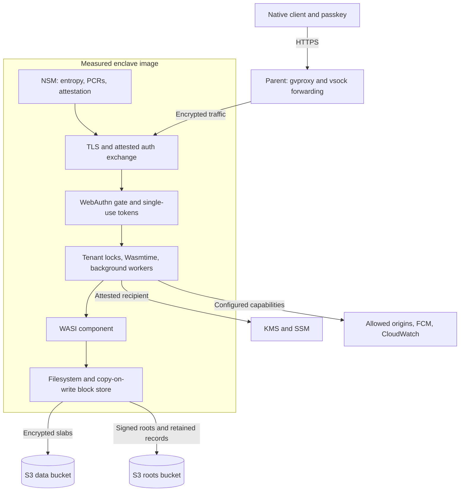

# enclave-runtime

**Stateful WebAssembly services inside AWS Nitro Enclaves—with encrypted storage, attested connections, passkey authorization, and work that continues after the client disconnects.**

Write an application as a WASI component. Give it ordinary files, a SQLite database, HTTP handlers, and optional background callbacks. The runtime provides the machinery around it: an S3-backed filesystem, HTTPS terminated inside the enclave, tenant isolation, an attestation-aware authentication flow, durable schedules, outbound connections, and device wake notifications.

The project began as **s3-wasi-fs**. The filesystem is now the foundation of a larger runtime, and remains independently usable through `s3fs-core` without Wasmtime or enclave hardware.

A client can check **which runtime booted, which application it loaded, and which TLS certificate belongs to that enclave** before authorizing an interaction. The application can persist state without exposing its filenames or plaintext blocks to the storage operator. That combination is useful for private application backends, personal agents, and interactive services that must keep working while their owner's phone is offline.

> **Pre-1.0, under active correctness review.** The implementation includes the storage engine, serving runtime, KMS recipient flow, and deployment tooling. It is not a production-readiness claim. Real Nitro/KMS validation and garbage collection remain outstanding.

## Contents

- [What has been built](#what-has-been-built)
- [Try it locally](#try-it-locally)
- [Architecture and trust boundaries](#architecture-and-trust-boundaries)
- [The encrypted filesystem](#the-encrypted-filesystem)
- [Boot, state identity, and key release](#boot-state-identity-and-key-release)
- [Serving and verifying an application](#serving-and-verifying-an-application)
- [Passkeys, tenants, and interaction approval](#passkeys-tenants-and-interaction-approval)
- [Work beyond a request](#work-beyond-a-request)
- [Running SQLite](#running-sqlite)
- [Time, entropy, and guest output](#time-entropy-and-guest-output)
- [Configuration reference](#configuration-reference)
- [Build, test, and contribute](#build-test-and-contribute)
- [Build and deploy an enclave](#build-and-deploy-an-enclave)
- [Use the storage engine directly](#use-the-storage-engine-directly)
- [Limits and remaining work](#limits-and-remaining-work)
- [Repository guide](#repository-guide)

## What has been built

| Capability | Implementation and practical result |
|---|---|
| **Encrypted, verifiable storage** | Copy-on-write block trees, AES-256-GCM encryption, BLAKE3 checksums, Ed25519-signed root records, and a hash-chained commit history. S3 contains opaque slabs rather than one object per pathname. |
| **A useful filesystem** | Reads, writes, sparse growth, directories, atomic rename, hard links, symlinks, timestamps, open-file unlink, and read-only historical snapshots. The guest uses `wasi:filesystem@0.2.x`. |
| **State-aware boot** | Explicit genesis, resume, upgrade, and refusal paths; an attested origin receipt ties a filesystem to its configured buckets, genesis root, and sealed-key reference. Retained reads look beneath S3 delete markers. |
| **Measured application loading** | The runtime fetches a component at boot, extends and locks PCR16, then asks for its key. PCR0 identifies the runtime image and measured configuration. A guest update need not rebuild the runtime image. |
| **KMS recipient key release** | `GenerateDataKey` and `Decrypt` use an enclave recipient; SSM holds the KMS ciphertext, and the roots bucket holds a checked pointer. The implementation and envelope tests exist; AWS hardware integration still needs validation. |
| **HTTPS and attestation** | Enclave-owned TLS keys, ACME TLS-ALPN-01, encrypted certificate caching, and nonce-bound attestation on `/auth/*` responses. Verification checks the actual connection certificate. |
| **Passkeys and tenant isolation** | WebAuthn registration, user verification, single-use interaction tokens, a filesystem scope per tenant, and a separate guest execution slot for each tenant. Native Android origins are configurable. |
| **HTTP/2 and bidirectional gRPC** | HTTP/1.1 and HTTP/2 share the listener. Guests can answer while a request is still arriving, with backpressure and trailers; a `tonic` client tests the example guest's framing. |
| **Durable background tasks** | Tenant-local schedules, recurring jobs, bounded retries, persisted status/results, and callbacks under the same tenant lock as interactive work. |
| **Connections held by the runtime** | Durable connection instructions, an SSE receive path, POST-based replies, reconnect backoff, and a fresh guest callback for incoming messages. A counterparty can initiate while the user is absent. |
| **Device wake notifications** | Runtime-owned Firebase Cloud Messaging integration, tenant-scoped device enrollment, coalescing, bounded queues, and content-free wake signals. |
| **Controlled guest egress** | Denied by default; a deployment may allow exact HTTP(S) origins. The production image measures this policy alongside the application environment. |
| **Operational tooling** | Structured guest logs, optional CloudWatch forwarding, PTP/NSM adapters, reproducible EIF builds, a QEMU development enclave, persistent development stores, and Packer/OpenTofu deployment definitions. |

The examples make these capabilities tangible: [`guest-http`](examples/guest-http/) exercises state, isolation, tasks, and notifications; [`guest-grpc`](examples/guest-grpc/) demonstrates interactive streaming; [`guest-sqlite`](examples/guest-sqlite/) drives a real C database through the filesystem. The gRPC signing-session example exchanges demonstration messages; it does not implement a cryptographic signing protocol.

## Try it locally

There are two useful starting points. Use the host tests or [embed `s3fs-core`](#use-the-storage-engine-directly) to explore the storage engine without an enclave. Use the QEMU harness to develop against the complete measured boot and serving path.

### 1. Check the core on your machine

From the repository root, with Rust and its native build prerequisites installed:

```bash
cargo test -p s3fs-core --lib
cargo test --workspace --lib
```

These commands need neither Docker nor a live AWS account. The workspace library tests include cryptography, storage, authentication, attestation verification, and runtime policy tests. Tests marked ignored require additional fixtures; a default pass does not exercise them.

### 2. Start the complete development enclave

The harness targets Linux with working KVM and vsock, Docker, Nix with flakes, Rust, and the `wasm32-wasip2` target. It also uses `python3`, `jq`, `curl`, and `openssl`. Run these commands from the repository root:

```bash
rustup target add wasm32-wasip2
sudo modprobe vsock_loopback

docker build -t s3fs-qemu-nitro:latest deploy/qemu-nitro
cargo install vhost-device-vsock --version 0.3.0 --locked \
  --root target/qemu-nitro/tools

# Builds the example guest and starts the supporting services.
deploy/qemu-nitro/dev-enclave.sh --keep-store
```

The first run builds an enclave image and can take substantially longer than a host test. The harness starts MinIO, the local ACME CA, networking, and the emulator; prints the URL, PCR0, PCR16, and trust-root path; then stays running. Its default URL is `https://127.0.0.1:8443`.

**The emulator exercises the protocol, not AWS's hardware trust boundary.** Its master key is a development key. It generates its own attestation signing chain because QEMU's NSM cannot produce an AWS-signed document. Pebble supplies local ACME certificates. These are suitable for test data, including when this harness runs on a public host.

### 3. Make an authenticated, stateful request

In another terminal, substitute the two measurements printed by the harness:

```bash
target/release/passkey-client \
  --url https://127.0.0.1:8443 \
  --state target/qemu-nitro/dev/alice.json \
  --trust-root target/qemu-nitro/dev/trust-root.der \
  --pcr0 <printed-pcr0> --pcr16 <printed-pcr16> \
  get --path /counter
```

Run it again with the same state file to observe the persistent counter. The client registers a software passkey for testing, verifies the enclave, and approves the request. A different state file registers a different tenant. The software authenticator is available through the `testing` feature and is not part of the production image.

With `--keep-store`, stopping and restarting the harness preserves the filesystem and registered credentials. Read the new pins at each boot: the emulator's attestation root changes, and a different guest changes PCR16. `--fresh --keep-store` intentionally discards the retained development store.

### 4. Bring your own component

```bash
deploy/qemu-nitro/dev-enclave.sh \
  --guest path/to/component.wasm \
  --keep-store \
  --guest-egress http://192.168.127.254:7070 \
  --guest-env SERVICE_URL=http://192.168.127.254:7070
```

The guest must implement `wasi:http/incoming-handler`; optional tasks, notifications, and held connections use the [WIT interfaces](wit/). The default emulator image enables background tasks and therefore also requires `run-task`. For an HTTP-only component, add `--guest-env S3FS_BACKGROUND_TASKS=false`; the harness merges this into the measured runtime image environment, and the runtime filters it out of the guest environment. `192.168.127.254` reaches the development host through gvproxy. Omit the egress option when the guest needs no external service.

The [development guide](docs/DEV_ENCLAVE.md) covers native app origins, public-domain ACME, real FCM, memory sizing, preserved stores, `--pack`/`--prebuilt`, and troubleshooting. The harness defaults to the HTTP example if `--guest` is omitted.

**Why there is no bare-runtime laptop command here:** the serving binary measures its guest into PCR16 before booting the store. That requires an NSM; `--tls off` and a static master key do not bypass it. Ordinary host integration tests supply a fake NSM through the library, while QEMU supplies an emulated device.

## Architecture and trust boundaries



The parent provides transport and decides whether the enclave runs. The design excludes it from plaintext application storage and enclave-terminated TLS when production key release and client verification are correctly configured. It can still stop the service, drop traffic, and observe traffic metadata.

AWS Nitro attestation, KMS, S3's authenticated service responses, Object Lock enforcement, and the approved runtime/guest are part of the trust model. The storage operator's ability to alter objects is distinct from S3 itself lying about which versions exist. Root freshness on a cold mount also needs an external lower bound when newer history may be hidden.

An approved guest is trusted with its tenant's data. Attestation identifies code; it does not prove that code is safe. Logging and allowed outbound destinations are deliberate disclosure channels and should be reviewed with the guest.

## The encrypted filesystem

### From a pathname to a root record

```text
wasi:filesystem descriptors and streams
                 │
                 ▼
Fs: paths, links, directories, handles, buffered records
                 │
                 ▼
Directory B+tree ──► object IDs ──► dnode array
                                     │
                            indirect block trees
                                     │
                         encrypted blocks in slabs
                                     │
                         signed root record + chain
```

Files and directories are addressed by object ID. Directory entries live in a separator-indexed B+tree. Dnodes describe objects and point into variable-width indirect block trees. Modified paths are rebuilt copy-on-write, so a commit publishes a new tree while older roots continue to describe their original state.

Blocks carry AES-256-GCM authentication and BLAKE3 checksums. Their authentication binds them to their expected position, preventing a valid block from simply being moved elsewhere in the tree. Keys derive from a 32-byte master secret and filesystem identity through HKDF. The data bucket holds slab objects; the roots bucket holds the signed history and runtime bootstrap objects.

Verifying a root authenticates the pointers beneath it; each block is verified when read. Mounting does **not** eagerly read or scrub every file.

### Commit and recovery

A transaction stages changed blocks and dnodes, uploads its slabs, waits for those uploads, then publishes a signed root with a conditional PUT. Publishing that root is the visibility boundary. A failed upload must not publish a tree pointing to missing data. Failed file sync retains dirty buffers for a retry.

The current transaction protocol also publishes a claim before a newly opened session encrypts blocks, and reclaims after an abandoned or failed transaction. Its purpose is to avoid reusing `(transaction group, block sequence)` as an AEAD nonce after a crash or competing mount. S3 accepts a conditional PUT over a delete marker, so publication then reads back the retained version: a mount whose record was not written first loses, even when its PUT succeeded.

This is a **single-writer filesystem**. Independent writable mounts and multiple active schedulers are not a supported deployment model. A conflict poisons the losing mount rather than silently merging histories.

### Filesystem behavior

| Operation or property | Behavior |
|---|---|
| Read/write/stat/list/sync | Implemented through the core `Fs` API and WASI adapter. File writes are buffered; sync/close drives durability. |
| Rename | Directory-entry changes commit atomically; moving a directory does not copy every descendant. Moves into the directory's own subtree are rejected. |
| Sparse files | Growth creates holes; reads return zeroes without materializing all intervening blocks. |
| Hard links | Multiple directory entries reference one object, with a maintained link count. |
| Symlinks | Supported, with a default traversal limit of 40 and resolution confined to the guest's filesystem scope. |
| Unlink while open | The open handle retains access until its final close. |
| Identity and metadata | Object identity, link counts, and timestamps come from the filesystem rather than inferred S3 filenames. |
| Snapshots | Historical root records can be opened read-only through `Fs::open_snapshot` or the store API; they share unchanged blocks. They are not an automatic guest-visible snapshot directory. |
| Freshness | The session floor only rises. `--min-root-seq` supplies an external floor for a cold mount. |
| Space reclamation | Garbage collection is not implemented. Historical and orphaned slabs consume storage. |

The detailed [compatibility matrix](docs/COMPATIBILITY.md) describes WASI/POSIX differences. This is a WASI filesystem implementation and embeddable Rust engine, not a host FUSE mount or a general replacement for a Linux filesystem.

### Defaults and cost model

| Store setting | Default |
|---|---:|
| Record size | 128 KiB |
| Maximum slab size | 64 MiB |
| Decrypted block-cache budget | 64 MiB |
| Concurrent slab PUTs | 8 |
| Root-chain links checked at mount | 1 |
| Per-root COMPLIANCE retention | 10 × 365 days |

[`StoreConfig`](crates/s3fs-core/src/store/config.rs) validates these settings. Record sizes must be powers of two from 4 KiB through 1 MiB. Retention is finite: an operational retention policy must account for the history a deployment still relies on.

S3 round trips dominate durable mutations. Batching application work reduces commit overhead; smaller writes may still rewrite a whole record and its tree path. Tenant handlers can execute concurrently, but their commits share one transaction lock. Snapshot sharing avoids copying the whole filesystem, while retaining old state still costs space for its changed blocks.

## Boot, state identity, and key release

### Explicit state origins

A missing store is not automatically an invitation to create an empty replacement. The boot machine checks the retained state-origin receipt, the sealed-key object, the genesis root, and the record for the running runtime/guest pair.

The origin commitment includes the filesystem ID, data and roots buckets, prefix, genesis root hash, and the SHA-256 of the sealed-key representation. It is encoded with a domain tag and CBOR, then hashed with BLAKE3. The receipt attests to that commitment.

| Observed state | Outcome |
|---|---|
| No origin receipt and no existing state | Genesis: provision key material, create the store, publish origin and pair records. |
| State exists without its receipt, or receipt exists without required state | Refuse to boot. |
| Origin and this runtime/guest pair verify | Resume. |
| Origin verifies but this pair has no record | Upgrade path: record the new pair after key release and state verification. |
| Existing origin/pair record is inconsistent or invalid | Refuse to boot. |

Bucket identity and policy live in the measured image. Otherwise, a host could point an approved runtime at a different empty bucket and make a new store look legitimate.

[`Backend::get_retained_blob`](crates/s3fs-core/src/backend/mod.rs) reads object versions beneath delete markers. The S3 backend follows version-list pagination and fetches a selected version by ID. Missing version-list permissions cause a failure rather than a false report that no record exists. The retained version is the oldest one listed, and root publication uses the same read to confirm it wrote first.

### KMS is implemented; hardware validation remains

The production key source is [`KmsAttestedKey`](runtime/src/keys/kms.rs), selected explicitly with `--master-key-source kms`:

1. Load the guest, extend PCR16 with its hash, and lock the register.
2. Generate an enclave recipient key and put its public key into an NSM attestation request.
3. At genesis, call KMS `GenerateDataKey` with the recipient; on resume, call `Decrypt` with the recipient.
4. Require and unwrap `CiphertextForRecipient` inside the enclave; the implementation does not use a plaintext response field as a fallback.
5. Keep the KMS ciphertext in SSM. Persist a pointer containing the parameter name, KMS key identity, encryption context, and ciphertext digest in the roots bucket.

The encryption context includes filesystem identity and environment. [`recipient.rs`](runtime/src/keys/recipient.rs) parses and validates the CMS envelope. The origin receipt commits to the sealed pointer, and loading the SSM parameter checks the ciphertext digest.

The deployment's KMS policy must constrain **both** `kms:GenerateDataKey` and `kms:Decrypt` using **both** `kms:RecipientAttestation:PCR0` and `kms:RecipientAttestation:PCR16`. The runtime implements the exchange; KMS policy is what enforces release. A broader alternate grant can undermine that policy.

`--master-key-source static --master-key <64-hex-characters>` is the development alternative. It stores an explicitly unsealed representation and does not protect the key from its operator. Supplying a plaintext master key in KMS mode is refused. There is no implicit default key source.

### Guest upgrades

The runtime image names a guest object in the roots bucket. It measures the bytes it actually fetched:

```text
fetch component → SHA-256(component) → extend and lock PCR16 → key release → mount
```

PCR16 is the SHA-384 extension of the zero register with that SHA-256 digest; it is not just the component's raw SHA-256. `nitro-attest --measure` and the guest-release build compute the value clients and policies must pin.

A guest-only upgrade changes the object, approved PCR16, and client pins. Changes to runtime code or measured deployment configuration change PCR0 and require an image rebuild. Preserve compatibility for persisted application data and queued task payloads: outstanding work runs the newly approved guest. Origin and upgrade records describe provenance; they do not turn attestation into an application migration system.

## Serving and verifying an application

### HTTP, TLS, and streaming

The guest implements `wasi:http/incoming-handler` and receives parsed HTTP requests. Rustls terminates TLS inside the enclave; the parent forwards encrypted traffic over gvproxy/vsock. HTTP/2 is negotiated through ALPN alongside HTTP/1.1. A gRPC guest can read request messages while writing its response, including response trailers.

Production TLS uses ACME TLS-ALPN-01 on the forwarded TLS port. `--tls acme` requires domains and an ACME directory reachable from the enclave; `--acme-directory` can select a private CA. The QEMU harness uses Pebble by default. `--tls off` is a plaintext development mode, not an enclave confidentiality boundary.

The runtime creates and retains the TLS private key inside its boundary. ACME account/certificate material is encrypted under a derived master key and cached outside the guest's preopen. This avoids exposing the TLS key as an application file and avoids reissuing a certificate on every restart.

### Attest the connection before approving it

| Header | Contract |
|---|---|
| `x-enclave-nonce` | Required on every request. Fresh client-chosen bytes, base64url without padding, 8–64 bytes after decoding. Missing/malformed values are rejected before routing. |
| `x-enclave-attestation` | Present on attested `/auth/*` responses; contains the base64-encoded COSE document. Guest responses have this header removed. |

The document binds the client's nonce, the TLS leaf certificate actually used for that connection, and the component hash. Its `user_data` is:

```text
0x12 0x20 || SHA256(TLS leaf DER) || 0x12 0x20 || SHA256(component)
```

A native client verifies the signature and certificate chain against its trusted Nitro root (or the explicitly pinned emulator root), document validity/freshness, its nonce, PCR0, PCR16, and the certificate hash. It then pins that certificate for the operation's TLS connection **before sending its token or sensitive payload**. Both measurements matter: an arbitrary runtime could write a convincing PCR16, while PCR0 alone no longer identifies the separately loaded guest.

The normal challenge exchange performs attestation; a separate probe is unnecessary. `GET /auth/` can also obtain an attested method refusal for diagnostics. Guest responses do not incur another NSM signature. A client must require the proof on the authentication responses where it belongs and must not treat its intentional absence on guest responses as a downgrade.

The document proves a connection and code identity. It does **not** sign a response body, prove a guest's result correct, or attest the latest filesystem root for every request. Ordinary browser JavaScript cannot inspect the TLS peer certificate needed by this flow; the supplied reference client and integration guide target native clients.

The runtime checks the attestation header against a 16 KiB ceiling at startup. Client transports must budget for the whole response head, including the certificate chain; the existing client guidance uses at least 32 KiB. Actual NSM latency and sustainable authentication throughput remain hardware measurements to obtain.

See [client integration](docs/CLIENT_INTEGRATION.md), [streaming](docs/STREAMING.md), and the standalone [`nitro-attest` verifier](crates/nitro-attestation/src/bin/nitro-attest.rs).

## Passkeys, tenants, and interaction approval

### One approval, one interaction

When WebAuthn is configured, a request reaches the guest only after redeeming an unspent interaction token:

```text
POST /auth/request/options   {credential_id, method, path, query}
         │
         ├─ verify attestation and pin the enclave's TLS certificate
         ├─ obtain a user-verified passkey assertion
         ▼
POST /auth/request/verify    {challenge_id, assertion}
         │
         └─ receive a short-lived, single-use token
         ▼
application request         Authorization: Bearer <token>
```

The WebAuthn verifier checks the challenge, exact allowed origin, relying party, signature, and user verification. The runtime enforces expiry, one-time use, registered credentials, and revocation. Tokens contain 32 random bytes, are indexed by their SHA-256, and disappear at restart. Redemption consumes the token before dispatch; an invalid attempt does not leave it reusable.

**The approval binds method, path, and query—not the request body or each stream message.** It authorizes an interaction, which may be an ordinary request or a bidirectional stream. Applications needing approval of exact transaction bytes need an additional application protocol. The gRPC demonstration should not be treated as transaction-signing authorization.

Registration is open and creates a new empty tenant. It does not grant access to an existing tenant. This also means registration is not an admission-control or anti-abuse system. `--max-tenants` limits cached execution slots, not the total durable user population or all active resource use.

Android app origins can be explicitly allowed as `android:apk-key-hash:<base64url-sha256>`. The app/domain association and exact signing-certificate origin must match the deployment; adding an allowed origin changes measured image configuration. See the [client guide](docs/CLIENT_INTEGRATION.md) for the complete registration and approval exchange.

### Tenant storage and instance lifetime

Registration mints a random **16-byte** tenant ID and stores it with the credential. The runtime supplies tenant identity to the guest; a caller cannot select another tenant using a request header. A tenant sees its own directory under `/tenants/<id>` as `/`.

Absolute paths, `..`, absolute symlinks, and parent-descriptor traversal stay within that scope. The filesystem and decrypted-block cache are shared; each tenant has a separate lock and guest instance. Runtime records under `/runtime` remain outside the tenant preopen.

A healthy HTTP instance may be reused **for the same tenant**. It is recycled after configured limits and discarded after failures or unsettled resources. Background and message callbacks use fresh instances under the tenant lock. Never rely on warm memory for durable state: eviction, traps, restarts, and background activity can remove it. Files a discarded instance left open are released without being flushed; close or sync what must persist before the call returns.

One tenant's interactive requests, background tasks, and incoming-message callbacks serialize with each other. Different tenants can execute concurrently; commits still serialize through the shared store. An open inbound stream holds its tenant's slot through the invocation/body lifecycle, so the same tenant's next operation may wait. Anonymous calls, where authentication is disabled, share one execution slot over the runtime filesystem.

## Work beyond a request

### Durable background tasks

Enable `S3FS_BACKGROUND_TASKS=true` with authentication and a guest exporting `enclave:tasks/background@0.1.0`'s `run-task`. The [`queue` interface](wit/tasks/tasks.wit) supports enqueue, status, cancel, and forget. Tenant identity comes from the invocation, not a guest-supplied argument.

An authenticated interactive call can schedule work for later or specify a recurring interval. Records live in the encrypted filesystem and survive restart. Workers honor per-tenant serialization, defer busy tenants without spending retries, enforce an execution deadline, and store bounded errors and results. Recurring intervals must be at least one second; payload and result limits are 64 KiB.

Execution may repeat after a crash. Handlers must deduplicate using the supplied **run ID**; a recurring task's occurrences have different run IDs. Writing an application file and enqueueing a task are separate mutations, not one atomic application transaction. Revoking a passkey does not automatically cancel schedules it authorized. Background callbacks cannot grant themselves more queue authority.

The [background-task guide](docs/BACKGROUND_TASKS.md) describes retries, occurrence identity, cancellation, limits, and upgrade behavior. The scheduler requires one active owning enclave; distributed leases and fencing are not implemented.

### Connections a counterparty can use first

The [`enclave:streams/connection@0.1.0` interface](wit/stream/stream.wit) lets an interactive guest ask the runtime to maintain a connection to an allowed origin:

```text
stream-open(id, origin)       maintain a durable connection instruction
stream-close(id)              remove that instruction
stream-send(id, payload)      send through the runtime
stream-status(id)             inspect connection status
on-message(id, message-id, payload) → reply bytes
```

The runtime keeps the network connection while no guest is executing. Incoming SSE events invoke `on-message` in a fresh, tenant-scoped instance. Nonempty replies are POSTed back; a guest may also send from another active invocation. The peer contract is:

```text
GET  <origin>/escrow/stream?id=<tenant-hex>-<stream-id>
POST <origin>/escrow/send?id=<tenant-hex>-<stream-id>
```

SSE `data` contains base64 bytes; an `id` supplies message identity, with a content-derived fallback when absent. The tenant prefix prevents the same guest-local name from colliding across users. The runtime limits a tenant to eight connections and each message to 256 KiB, with reconnect delays from one second up to five minutes. The origin policy is checked again on reconnect.

Connection instructions are durable; messages are not a durable inbox/outbox. Deduplicate replayed IDs in the application and arrange replay/acknowledgment with the peer. Do not infer exactly-once delivery or lossless recovery from an SSE reconnect. Closing and reopening a stream, to the same origin or another, drops the old connection and dials a new one.

### Wake a device without sending its private content

The [`enclave:notify/notify@0.1.0`](wit/notify/notify.wit) capability lets a tenant enroll devices and ask the runtime to send a data-only FCM wake. The app fetches the details through an authenticated connection after waking.

Wake payloads contain a schema version, category, and optional tenant-local reference. There is no user-facing title/body or notification object. Choose opaque labels when the category or reference could reveal sensitive meaning; the provider sees the destination, labels, and timing.

Device enrollment/removal requires an interactive invocation. Background work can wake already enrolled devices, but cannot enroll destinations or read stored device tokens back. The runtime owns OAuth, the service-account credential, HTTPS, coalescing, backoff, and a bounded queue. Delivery is best effort and is not a durable audit or messaging channel.

Configure `S3FS_FCM_PROJECT_ID` plus one credential source: literal service-account JSON for development, or an SSM parameter name for deployment. The local harness supplies an FCM stub. See [notifications](docs/NOTIFICATIONS.md) for the WIT contract, limits, and operational behavior.

### Guest egress

The default policy refuses outgoing HTTP. `--guest-egress-origin` / `S3FS_GUEST_EGRESS_ORIGINS` permits exact scheme/host/port origins. HTTPS uses the runtime's configured verification path and compiled roots; direct guest socket access is not granted. The allowlist also governs held connections.

This permits useful integrations without granting arbitrary network access, but an allowed destination can receive anything the approved guest sends to it. Production origin lists and guest environment values are baked into the image and affect PCR0.

## Running SQLite

SQLite is the main application-level filesystem workload: real C code performs page-granular random I/O, rollback-journal updates, and integrity checks. [`guest-sqlite`](examples/guest-sqlite/) covers DDL, transactions, savepoints, constraints, joins, CTEs, window functions, blobs, triggers, schema changes, `VACUUM`, JSON, FTS5, and R-Tree where available.

Build it using wasi-sdk:

```bash
scripts/wasi-sdk.sh
scripts/build-guest.sh sqlite

deploy/qemu-nitro/dev-enclave.sh \
  --guest examples/guest-sqlite/target/wasm32-wasip2/release/guest-sqlite.wasm \
  --guest-env S3FS_BACKGROUND_TASKS=false
```

SQLite exports the HTTP handler, not `run-task`, so the override disables the emulator's default background-task startup requirement. Using the printed pins, request `/` with `passkey-client` to run the workload. The response reports `OK` or a failure; timings go to guest output. Each run removes and recreates its benchmark database, so use a dedicated development tenant and do not treat `/` as a health check. `SQLITE_SCALE` controls the workload size; the current example defaults to 2,000 rows.

The two required pragmas are:

```rust
conn.pragma_update(None, "temp_store", "MEMORY")?;
conn.pragma_update(None, "locking_mode", "EXCLUSIVE")?;
```

SQLite's temporary-directory probing and advisory locking assume syscalls that this WASI environment does not supply. Use the default rollback-journal mode (`DELETE`). WAL requires the shared-memory/mapping facilities this configuration lacks. Runtime serialization protects one tenant from concurrent callbacks; the guest must still avoid opening competing SQLite connections inside its own invocation.

### Recorded workload results

The following are the repository's earlier measurements against local MinIO with 20,000 accounts and 40,000 entries. They were **not rerun for this documentation update**, are not current release benchmarks, and should not be extrapolated to remote S3 latency.

| Phase | Elapsed | Rate |
|---|---:|---:|
| Bulk insert, 20,000 rows in one transaction | 142 ms | 140,884 rows/s |
| Point select by row ID | 2.5 ms | 405,948 queries/s |
| Indexed select | 1.3 ms | 785,850 queries/s |
| Update 500 rows in one transaction | 63 ms | 7,963 rows/s |
| Blob write | 128 ms | 18.5 MB/s |
| Blob read and verify | 41 ms | 57.8 MB/s |
| Incremental blob I/O, 512 KiB scattered | 242 ms | 2.2 MB/s |
| `VACUUM` | 471 ms | — |
| `PRAGMA integrity_check` | 136 ms | — |
| 25 inserts, autocommit | 1,796 ms | 14 rows/s |
| 25 inserts, one SQL transaction | 69 ms | 364 rows/s |

The practical lesson is to batch writes. A SQL transaction is not necessarily one block-store commit—journal and filesystem sync operations matter—but it can greatly reduce durable round trips compared with repeated autocommit statements.

## Time, entropy, and guest output

### Clock and randomness

The runtime supplies guest clocks and random sources through its WASI environment. Filesystem timestamp operations requesting “now” use the same wall-clock adapter the guest sees.

| Setting | Modes |
|---|---|
| `--clock-source` | `ptp` requires the configured PTP device; `host` uses the system clock; `auto` tries PTP and warns when falling back. |
| `--ptp-device` | PTP device path, default `/dev/ptp0`. Availability must be checked in the target environment. |
| `--random-source` | `nsm` requires the NSM entropy source; `host` uses host randomness; `auto` selects an available source. |
| `--nsm-device` | NSM device path, default `/dev/nsm`. Host randomness does not supply PCRs or attestation. |

Production configuration explicitly requests trusted devices. Automatic fallbacks are convenient for host tests but should not silently define a deployment's trust policy. The diagnostic path and [`deploy/ptp-check.sh`](deploy/ptp-check.sh) help inspect clock availability; [`run-selftest.sh`](deploy/qemu-nitro/run-selftest.sh) exercises NSM behavior in the emulator.

### Logs are structured output, not an audit proof

Guest `stdout` and `stderr` pass through bounded line framing and a nonblocking logging queue. They become structured events tagged with their stream; guest text is an escaped field value rather than log syntax. Long lines and dropped records are accounted for. A guest cannot block its filesystem or request indefinitely by waiting on a remote log collector.

The default sink is tracing. Setting `S3FS_GUEST_LOG_GROUP` and `S3FS_GUEST_LOG_STREAM` enables CloudWatch forwarding to pre-created resources. The forwarder batches JSON events, retries transient failures with backoff, bounds retained work, and counts drops. Queued output can be lost on abrupt shutdown.

Guest output can contain secrets the guest chooses to print. Console logs are visible to the host, and a CloudWatch reader can read forwarded content. The parent role can also write forged records to the same CloudWatch stream. These are operational logs, not tamper-proof evidence. IMDSv2 credential resolution through the deployed networking path and real CloudWatch delivery still need hardware validation.

## Configuration reference

The binary's [`Cli`](runtime/src/main.rs) is the definitive flag reference:

```bash
cargo run -p enclave-runtime --bin enclave-runtime -- --help
```

Configuration embedded by Nix is part of the measured image. Changing a bucket, relying party, allowed origin, logging destination, or guest environment changes PCR0. The `S3FS_` environment prefix is retained from the filesystem's original name.

| Area | Main flags / environment |
|---|---|
| Store identity | `--bucket`, `--roots-bucket`, `--bucket-prefix`, `--fs-id`; `S3FS_BUCKET`, `S3FS_ROOTS_BUCKET`, `S3FS_BUCKET_PREFIX`, `S3FS_ID` |
| S3 access | `--region`, `--endpoint`, `--force-path-style`; AWS credentials/default chain; optional session token |
| Freshness | `--min-root-seq` / `S3FS_MIN_ROOT_SEQ` |
| Key source | Required `--master-key-source kms\|static` / `S3FS_MASTER_KEY_SOURCE` |
| KMS/SSM | `--kms-key-id`, `--master-key-parameter`, `--environment`; separate KMS/SSM endpoint overrides |
| Development key | `--master-key` / `S3FS_MASTER_KEY`, only with the static source |
| Component | `--guest-object` / `S3FS_GUEST_OBJECT`, or `--guest-path` / `S3FS_GUEST_PATH` |
| Listener and TLS | `--http-listen`, `--tls`, repeatable `--tls-domain`, `--acme-contact`, `--acme-directory` |
| WebAuthn | `--webauthn-rp-id`, `--webauthn-origin`, repeatable `--webauthn-allowed-origin` |
| Guest network | Repeatable `--guest-egress-origin` / `S3FS_GUEST_EGRESS_ORIGINS` |
| Guest environment | `--no-inherit-env`, repeatable `--guest-env NAME=VALUE` or `--guest-env NAME` |
| Background work | `--background-tasks true`, concurrency, timeout, total-record and per-tenant limits |
| Notifications | `S3FS_FCM_PROJECT_ID` plus `S3FS_FCM_SERVICE_ACCOUNT` or `S3FS_FCM_SERVICE_ACCOUNT_PARAMETER` |
| Logging | `S3FS_GUEST_LOG_GROUP`, `S3FS_GUEST_LOG_STREAM`; tracing filtering through `RUST_LOG` |

By default the guest inherits the runtime environment after `AWS_*` and `S3FS_*` filtering. That is appropriate only when the environment is deliberately curated. Host-side callers should use `--no-inherit-env` and explicitly name values; the denylist does not know every application's secret variable.

| Runtime limit | Default |
|---|---:|
| Request progress timeout | 30 s |
| S3 operation timeout | 30 s |
| WebAuthn challenge lifetime | 60 s |
| Unspent interaction token lifetime | 60 s |
| Maximum interaction lifetime | 300 s |
| Cached tenant limit | 64 |
| Tenant idle timeout | 900 s |
| Requests before instance recycling | 10,000 |
| Background concurrency | 1 |
| Background attempt timeout | 30 s |
| Background record limit, global / per tenant | 1,024 / 64 |

The progress watchdog and interaction lifetime solve different problems: an active stream can outlive a short request timeout, while the overall interaction remains bounded. Guest linear memory has no explicit per-instance runtime quota yet; these settings are not a complete resource-admission system.

## Build, test, and contribute

Use the checked-in Rust toolchain configuration and lockfile. Native builds need a C/C++ toolchain, `pkg-config`, and OpenSSL development files for the WebAuthn dependency. The standalone storage crate has no Wasmtime dependency; the full runtime includes the AWS SDKs and Wasmtime and is a larger build.

```bash
# Host artifacts; the runtime includes S3 support without an `aws` feature.
cargo build --locked --release -p enclave-runtime
cargo build --locked --release -p nitro-attestation --features cli --bin nitro-attest

# Each guest is its own Cargo workspace.
scripts/build-guest.sh http
scripts/build-guest.sh grpc

# Development-only software passkey client.
cargo build --release -p enclave-runtime --features testing --bin passkey-client
```

[`scripts/`](scripts/) contains the same validation entry points CI uses:

| Command | Coverage / prerequisites |
|---|---|
| `scripts/ci-check.sh` | Formatting, Clippy with warnings denied, workspace library tests, and boot-origin tests. No Docker or built guest required. |
| `scripts/ci-guests.sh` | Builds HTTP/gRPC guests and the test client; tests tasks, held connections, guest dispatch, TLS binding, HTTP/2, gRPC, authentication, and logging. |
| `scripts/ci-storage.sh` | Real MinIO/S3 protocol, retention, remount, corruption, rollback, and competing-claim tests through testcontainers. Requires Docker; runs ignored tests serially. |
| `scripts/ci-e2e.sh` | Guest and storage suites, required local tools, then the QEMU stack. Requires Linux virtualization, Docker, and Nix. |
| `deploy/qemu-nitro/run-e2e.sh` | Direct emulator harness once prerequisites are installed: ACME, authenticated requests, persistence, state origins, and measurement checks. |
| `scripts/ci-bench.sh` | Criterion storage and instance-cost benchmarks; writes `bench.txt`. |
| `scripts/wit-drift.sh` | Checks mirrored guest/runtime WIT definitions for drift. |

`cargo test --workspace` alone does not stand in for these stages: ignored tests need `--include-ignored`, examples must be built separately, and some binary tests require features. `scripts/ci-sqlite.sh` is an enclave-dependent workload helper and is deliberately not a generic hosted-runner CI gate.

Validation results belong to a revision; the README does not turn an old test count into a permanent claim that CI is green.

When extending the runtime, add the capability to the appropriate WIT interface, enforce authority using the invocation's tenant context, and check the matching integration suite. Keep the production image free of the `testing` feature. For stateful changes, test a remount or interrupted operation as well as the successful in-process path.

## Build and deploy an enclave

### Reproducible artifacts

Nix builds the code and configuration inside the enclave. Packer builds the parent AMI; OpenTofu defines deployment resources. The parent is outside the measured image, so these are separate build concerns.

```bash
# Edit deploy/nix/deployment.nix for the intended deployment first.
nix build .#eif
# result/s3fs.eif and result/pcr.json

nix build .#guest-release --out-link guest-release
# guest-release/guest.wasm and guest-release/guest-pcr16.json

# Rebuild and compare the enclave output.
nix build .#eif --rebuild
```

The production template selects KMS but does not currently expose dedicated KMS resource fields in `deployment.nix`. Wire `S3FS_KMS_KEY_ID` and `S3FS_MASTER_KEY_PARAMETER` into the measured `runtimeImage.env` in `flake.nix` before building your deployment image; configure `S3FS_ENVIRONMENT` as appropriate. Setting environment variables on the parent service does not inject them into an already-built EIF. These identifiers are configuration, not plaintext key material.

Image assembly normalizes cpio ordering, ownership, timestamps, and device/inode metadata and controls the EIF builder's timestamp. Dependencies are pinned. The kernel, bootstrap `init`, and NSM module remain pinned AWS prebuilt inputs; a reproducible output is not a claim that every input was independently built from source. See the [Nix build guide](deploy/nix/README.md).

### Deployment sequence

1. Set the bucket identities, filesystem ID, region, guest object key, TLS domains, relying party, and enabled capabilities in [`deployment.nix`](deploy/nix/deployment.nix).
2. Build the runtime EIF and guest artifact; retain PCR0 and PCR16 as release outputs.
3. Use [`deploy/tofu`](deploy/tofu/) as the starting point for buckets, retention, parent resources, and logs. Provision the KMS key/policy, SSM parameter access, and related IAM permissions separately; this module does not currently supply the complete KMS/SSM setup. Review measured and infrastructure values together.
4. Upload the approved component to the configured object key and bind KMS release to the approved measurements.
5. Build/configure the parent with [`deploy/ami`](deploy/ami/), then start the enclave and gvproxy services. The parent forwards inbound TLS; it does not terminate application TLS.
6. Verify the boot mode, trusted device sources, actual key-release behavior, TLS/attestation binding, credential path, and persistence from a client pinning the release measurements.

The roots path needs version listing and reads by version ID as well as retained conditional publication. Object Lock protects versions for their retention period; it is not a general ban on creating delete markers or later versions.

For public **development** hosts, the QEMU script supports `--domain`, `--port 443`, `--acme-staging`, `--store-bind`, and packing artifacts on one machine for another. A publicly trusted TLS certificate does not make emulator attestations or its development master key equivalent to Nitro. Keep development MinIO credentials off public interfaces and use the full [development guide](docs/DEV_ENCLAVE.md).

## Use the storage engine directly

`s3fs-core` can be embedded independently. This complete example creates an in-memory filesystem, commits a file, remounts it, and reads it back. It needs `s3fs-core` and Tokio with macros and a runtime; no NSM, Wasmtime, Docker, or AWS credentials are involved.

```rust
use std::sync::Arc;
use s3fs_core::{backend::memory::MemoryBackend, Config, Fs, MasterSecret, OpenFlags};

#[tokio::main(flavor = "current_thread")]
async fn main() -> Result<(), Box<dyn std::error::Error>> {
    let data = Arc::new(MemoryBackend::new());
    let roots = Arc::new(MemoryBackend::new());
    let secret = MasterSecret::from_bytes([7; 32]); // Example only.
    let fs_id = [3; 16];
    let config = Arc::new(Config::default());

    let fs = Fs::create(data.clone(), roots.clone(), &secret, fs_id, config.clone()).await?;
    let file = fs.open("/hello.txt", OpenFlags::create_new()).await?;
    fs.pwrite(&file, 0, b"hello from encrypted storage").await?;
    fs.sync(&file).await?;
    fs.close(&file).await?;
    drop(fs);

    let fs = Fs::mount(data, roots, &secret, fs_id, config, None).await?;
    let file = fs.open("/hello.txt", OpenFlags::read_only()).await?;
    let bytes = fs.pread(&file, 0, 64).await?;
    assert_eq!(bytes.as_ref(), b"hello from encrypted storage");
    fs.close(&file).await?;
    Ok(())
}
```

For S3, enable **`s3fs-core`'s** `aws` feature and supply separate `AwsS3Backend` instances for the data and roots buckets. Create the roots bucket with Object Lock support and appropriate retention. Keep the master secret and filesystem ID outside untrusted storage; they select the keys used to verify the store. Use `Fs::create` only for an intentional new filesystem and `Fs::mount` for an existing one.

An embedded consumer owns its provisioning, boot policy, freshness floor, and handle lifecycle. The runtime's origin receipts, tenant gate, and KMS orchestration are higher layers, not automatic side effects of calling the core API.

## Limits and remaining work

| Area | Current boundary |
|---|---|
| Nitro production validation | Real recipient key release, refusal of substituted measurements, AWS-root attestation, device availability, IMDSv2 networking, and CloudWatch delivery need hardware evidence. |
| Garbage collection | Unimplemented. History, unreachable blocks, and failed-commit slabs accumulate. |
| Single active writer | No distributed writer coordination, scheduler fencing, or transparent multi-enclave failover. |
| Freshness and availability | An external root-sequence floor is needed for the general cold-mount rollback case. The parent/storage operator can deny service. |
| Authorization scope | A passkey approves a route and interaction; it does not approve every payload byte or signing round. |
| Delivery | Inbound streams, background callbacks, held connections, notifications, and logs have different retry/durability contracts. None provides universal exactly-once side effects. |
| Resource isolation | Warm-cache and queue limits exist; per-guest linear-memory quotas and comprehensive public-service admission control do not. |
| SQLite | Rollback journal and serialized access are supported. WAL and cross-instance advisory locking are outside this WASI setup. |
| Upgrade compatibility | The operator/guest must handle application schema and queued-payload evolution. A matching measurement is not a migration. |

The [roadmap](docs/ROADMAP.md) contains milestone history, including the storage work and planned garbage collection. Some planning prose predates the implemented KMS source; the current implementation and the revision-specific review distinguish code that exists from hardware validation still to be done.

## Repository guide

| Path | What to read or change there |
|---|---|
| [`crates/s3fs-core`](crates/s3fs-core/) | Storage backends, cryptography, block store, filesystem, MinIO tests, benchmarks. |
| [`crates/nitro-nsm`](crates/nitro-nsm/) | NSM device access, entropy, PCR operations, attestation requests, self-test binary. |
| [`crates/nitro-attestation`](crates/nitro-attestation/) | Attestation parsing/verification and the independent `nitro-attest` client. |
| [`runtime`](runtime/) | WASI adapter, measured boot, key sources, TLS/auth, tenancy, tasks, streams, notifications, logging, binary and integration tests. |
| [`examples`](examples/) | HTTP, gRPC, and SQLite component workspaces. |
| [`wit`](wit/) | Runtime capability contracts and component worlds. |
| [`deploy/nix`](deploy/nix/) and [`nix`](nix/) | Measured deployment configuration and reproducible EIF assembly. |
| [`deploy/qemu-nitro`](deploy/qemu-nitro/) | Development enclave, emulator self-test, shared startup code, local CA, and full-stack assertions. |
| [`deploy/ami`](deploy/ami/) and [`deploy/tofu`](deploy/tofu/) | Parent AMI/services and AWS infrastructure definitions. |
| [`scripts`](scripts/) | Guest builds, validation stages, MinIO helpers, and benchmarks. |
| [`docs/CLIENT_INTEGRATION.md`](docs/CLIENT_INTEGRATION.md) | Native-client registration, attestation, approval, and certificate pinning. |
| [`docs/STREAMING.md`](docs/STREAMING.md) | Inbound bidirectional streaming and its authorization/lifetime contract. |
| [`docs/BACKGROUND_TASKS.md`](docs/BACKGROUND_TASKS.md) | Durable scheduling, retries, idempotency, and callback authority. |
| [`docs/NOTIFICATIONS.md`](docs/NOTIFICATIONS.md) | Device enrollment and runtime-owned wake delivery. |
| [`docs/COMPATIBILITY.md`](docs/COMPATIBILITY.md) | Filesystem semantics and WASI limitations. |

## License

Workspace packages declare Apache-2.0 in [`Cargo.toml`](Cargo.toml).
