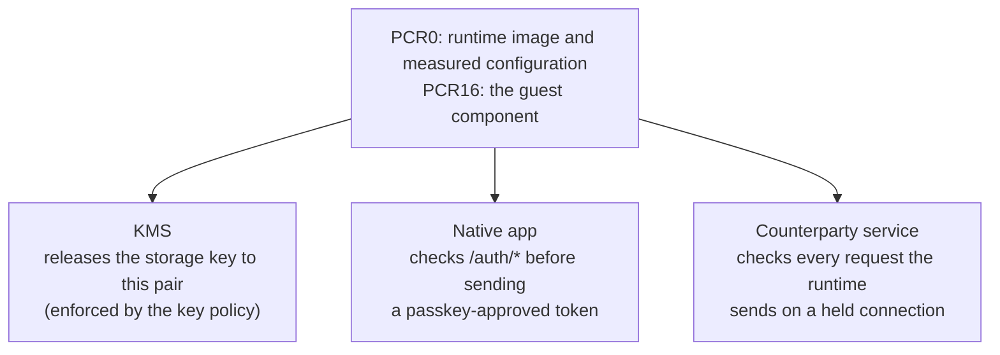
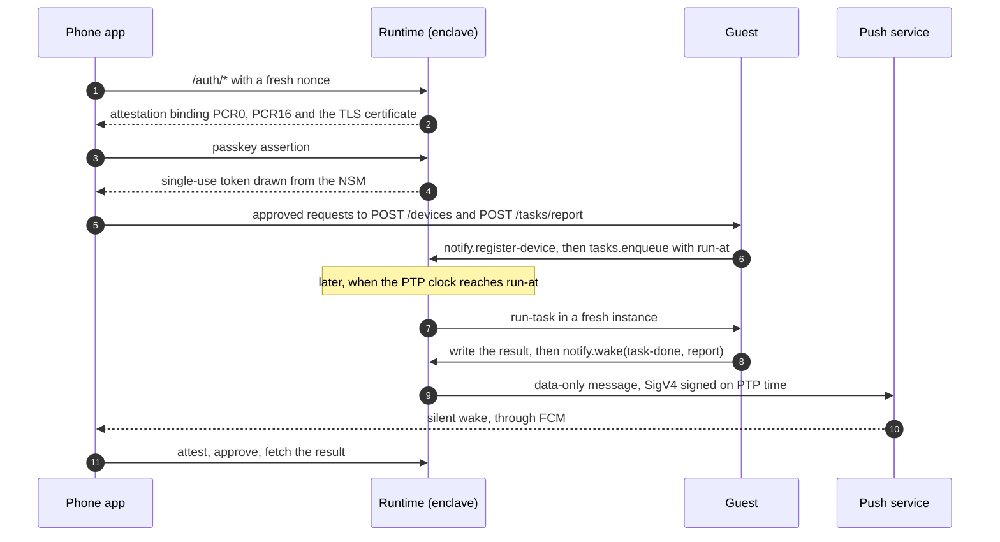
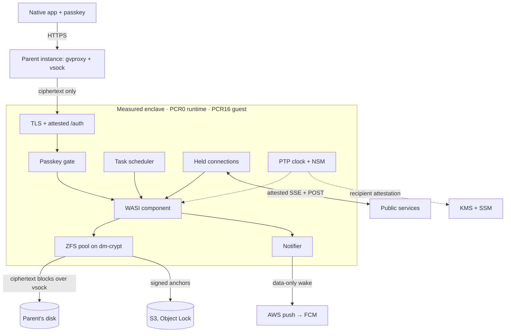

# enclave-runtime

**Run an ordinary WebAssembly component inside an AWS Nitro Enclave, where the enclave itself serves every standard WASI call, down to the hardware clock and the security module.**

Write the guest with plain `std`. `SystemTime::now()` reads the Nitro PTP hardware clock, `getrandom` reads the Nitro Security Module, `std::fs` writes to a store that is encrypted before anything reaches S3, and requests arrive over TLS terminated inside the enclave. The guest never touches a device path, a key or a certificate.

WASI has no way to reach a person or a service between requests, so the runtime adds [three WIT capabilities](#capabilities-beyond-wasi): **`enclave:notify`** wakes the owner's phone without revealing why, **`enclave:streams`** holds a connection a service can use to speak first and attests every request the runtime sends over it, and **`enclave:tasks`** runs durable work on the enclave's clock while no client is connected.

Every party that relies on the enclave checks the same two measurements: PCR0 for the runtime image and its configuration, PCR16 for the guest. KMS checks them before releasing the storage key, a native app before sending a passkey-approved request, and a service on every message the runtime sends it.

> **Pre-1.0, under active correctness review.** The runtime, its capabilities, the KMS recipient flow and the deployment tooling are implemented and tested, including end to end in an emulated enclave. Validation on real Nitro hardware and against live KMS and AWS End User Messaging Push is outstanding, as is storage garbage collection. This is not a production-readiness claim.

## Contents

- [Plain WASI, enclave hardware underneath](#plain-wasi-enclave-hardware-underneath)
- [One clock, one entropy source, one identity](#one-clock-one-entropy-source-one-identity)
- [Capabilities beyond WASI](#capabilities-beyond-wasi)
- [Try it locally](#try-it-locally)
- [Trust boundaries](#trust-boundaries)
- [Measured boot and key release](#measured-boot-and-key-release)
- [Verifying the enclave from a client](#verifying-the-enclave-from-a-client)
- [Storage](#storage)
- [Configuration](#configuration)
- [Build, test, and deploy](#build-test-and-deploy)
- [Limits and remaining work](#limits-and-remaining-work)
- [Repository guide](#repository-guide)

## Plain WASI, enclave hardware underneath

The runtime links the standard WASI 0.2 interfaces and serves each one from inside the enclave boundary:

| The guest writes | WASI interface | What answers it inside the enclave |
|---|---|---|
| `SystemTime::now()` | `wasi:clocks/wall-clock` | The Nitro **PTP hardware clock** (`/dev/ptp0`, disciplined by Amazon Time Sync), not the system clock the parent can set |
| `getrandom`, `OsRng`, key generation | `wasi:random/random` | The **Nitro Security Module**, read directly on every call with no DRBG in between |
| Hash-table seeding | `wasi:random/insecure-seed` | A fresh NSM draw for every instance |
| An HTTP handler | `wasi:http/incoming-handler` | TLS terminated **inside** the enclave, behind the passkey gate; the runtime sets the caller's tenant in `x-enclave-tenant` |
| An outbound HTTP request | `wasi:http/outgoing-handler` | **Denied by default.** Exact origins named in the measured image are allowed, verified against web PKI roots compiled into the image |
| `std::fs` | `wasi:filesystem` | A per-tenant ZFS dataset on an encrypted disk, anchored in S3 ([how](docs/STORAGE.md)) |
| `println!`, `eprintln!` | `wasi:cli/stdout`, `stderr` | Bounded, structured log records tagged `guest`, optionally forwarded to CloudWatch |
| `std::env::var` | `wasi:cli/environment` | The settings the guest file carries, measured into PCR16; nothing from the runtime's environment |
| stdin, raw sockets | `wasi:cli/stdin`, `wasi:sockets` | Stdin is closed. Sockets are linked so guests instantiate, but every address is refused |

`wasi:clocks/monotonic-clock` and `wasi:random/insecure` keep wasmtime's host-backed defaults. They measure durations and drive non-cryptographic generators; they never supply a timestamp or a secret.

Inbound HTTP/2 is negotiated per connection, so a guest can answer a bidirectional gRPC stream while it is still arriving ([streaming](docs/STREAMING.md), [`guest-grpc`](examples/guest-grpc/)).

There is no enclave SDK. The [example guest](examples/guest-http/src/main.rs) is `std`, `wstd` and `wit-bindgen`, and the same component bytes, and therefore the same PCR16, run in the QEMU development enclave and on Nitro.

## One clock, one entropy source, one identity

The runtime opens each trusted device once at boot and hands that one handle to everything that needs it, the guest's WASI imports and the runtime's own subsystems alike. A timestamp the guest reads is the one the scheduler acted on, and every secret in the system comes from the same device.

### One clock

An enclave has no NTP. The hypervisor sets its system clock, and the parent instance controls the hypervisor. The runtime instead reads the Nitro card's PTP hardware clock through the POSIX dynamic-clock interface, and every reader shares one adapter:

| Reader | What depends on it |
|---|---|
| Guest `wasi:clocks/wall-clock` | Every `SystemTime::now()`, including expiry checks in guest code |
| Filesystem `set-times` with "now" | File timestamps agree with the guest's clock |
| Task scheduler | `run-at` deadlines and recurring intervals |
| Push signing | The SigV4 date on every call to the push service. AWS checks it, which makes this the one place an outside party checks the enclave's clock; skew shows up as a refused signature, retried |
| Notification queue | Device enrollment times and retry backoff |

A read that fails mid-run returns the last good reading and logs a warning. A few milliseconds stale is harmless; a zero timestamp means 1970 dates, expired certificates and rejected tokens. A production build always reads PTP, so a missing device stops the boot. The emulator's `testing` build uses the host clock, because QEMU has no PTP device.

### One entropy source

`/dev/nsm` is the device that signs attestation documents. The runtime draws every secret and identifier it hands out from the same device:

| Consumer | What it draws |
|---|---|
| Guest `wasi:random/random` | Every byte, straight from the device (256 bytes per NSM request) |
| Guest `wasi:random/insecure-seed` | A fresh seed per instance, so no two instances share a hash seed |
| Authentication | Registration and challenge IDs, and the 32-byte single-use tokens that admit a request |

If the device fails, `wasi:random` stops the process rather than return predictable bytes. The clock can serve a stale reading because a stale timestamp is still a real one and a caller can notice. Predictable bytes look random to the guest, and a key built from them can never be detected downstream. A production build always reads the NSM. The TLS key comes from the kernel pool through `aws-lc-rs`. Inside an enclave the NSM is that pool's only seed, and requiring `/dev/nsm` at boot proves the runtime is in an enclave.

`enclave-runtime --self-check` prints the chosen clock, its skew against `CLOCK_REALTIME` and a sanity check of the entropy source, then exits without touching storage.

### One identity

Before asking for any key, the runtime uses the same NSM to extend PCR16 with the guest's hash and lock the register. The same device then signs every attestation document. Three independent parties check the resulting pair:


```mermaid
flowchart TB
    M["PCR0: runtime image and measured configuration<br/>PCR16: the guest component"]
    M --> K["KMS<br/>releases the storage key to this pair<br/>(enforced by the key policy)"]
    M --> C["Native app<br/>checks /auth/* before sending<br/>a passkey-approved token"]
    M --> S["Counterparty service<br/>checks every request the runtime<br/>sends on a held connection"]
```

PCR0 covers configuration as well as code: the push application, the WebAuthn origins and the bucket identities. An app that pins PCR0 has therefore also pinned which push application can wake its devices. A guest's own settings are not image configuration: they travel in the guest file ([`guest-env.py`](deploy/qemu-nitro/guest-env.py) writes them before it is uploaded), so PCR16 measures them with the guest's code and one image serves any deployment. Where a guest can send data is not configuration: a guest reaches the public internet and nothing else, by address, so what it sends is its own code's decision — and that code is PCR16.

## Capabilities beyond WASI

WASI has no interface for waking a person, letting a service speak first, or running something at 3 a.m. The runtime adds three small WIT packages for them. **No function takes a tenant ID.** The runtime binds each call to the tenant of the invocation making it, so a guest cannot reach another tenant's devices, connections or tasks.

A guest composes the worlds it needs. From the [example guest](examples/guest-http/wit/app.wit):

```wit
world app {
    include enclave:tasks/background@0.1.0;   // import the queue, export run-task
    import enclave:notify/notify@0.1.0;        // wake the tenant's devices
}
```

Held connections compose the same way, with `include enclave:streams/streaming@0.1.0`. Guests vendor the canonical definitions from [`wit/`](wit/), and `scripts/wit-drift.sh` fails if a copy drifts.

### `enclave:notify` — wake a phone without saying why

```wit
register-device: func(token: string) -> result<_, string>;   // interactive only
forget-device:   func(token: string) -> result<_, string>;   // interactive only
devices:         func() -> result<u32, string>;               // a count, never the tokens
wake:            func(category: string, reference: option<string>) -> result<_, string>;
```

A guest holds no push credential, so the runtime sends on its behalf through AWS End User Messaging Push, signing as the instance's role; the Firebase credential lives on the push application's FCM channel, inside AWS, and no image carries it. **A wake is data-only.** The payload crosses the parent instance, AWS and then Google, so it has no title, no body and no `notification` object, and no setting can add one. It goes as `RawContent`, which reaches the phone as written:

```json
{"data": {"v": "1", "category": "task-done", "ref": "invoice-42"},
 "android": {"priority": "high", "ttl": "3600s"},
 "apns": {"headers": {"apns-push-type": "background", "apns-priority": "5"},
          "payload": {"aps": {"content-available": 1}}}}
```

On waking, the app attests the enclave and fetches the details over its pinned connection, which the parent cannot read.

How notify draws on the rest of the runtime:

- **Credentials.** The runtime signs each call itself (SigV4, dated by the PTP clock) with the instance role's credentials, fetched from the metadata service at an address gvproxy maps for the runtime alone. It sends over an HTTPS client that trusts only the web PKI roots compiled into the image, because the parent answers the enclave's DNS.
- **Authority.** Enrolling or forgetting a device is a standing ability to reach a person, so it takes an interactive, passkey-approved call. Raising a wake from background work is the main use: a task finishes and tells its owner to come and look. A wake grants nothing; it uses an enrollment the owner already made.
- **Storage.** Device tokens live in `/runtime/devices` in the encrypted store, outside every tenant's scope. A guest enrolls a token and can only ever get a count back.
- **Delivery** is best effort and bounded. Repeat wakes for one `(tenant, category)` coalesce, and a full queue drops and counts instead of blocking the guest. Transient failures back off, and tokens the service reports gone are pruned. Each tenant can enroll 8 devices; enrolling a ninth evicts the oldest.

A parent that borrows the role can send wake signals through that one application and nothing more. A wake carries no data, and the app's response to any wake is to fetch over the attested channel. Set `ENCLAVE_PUSH_APP_ID` (measured, not secret). See [docs/NOTIFICATIONS.md](docs/NOTIFICATIONS.md).

### `enclave:streams` — let a service talk first

```wit
stream-open:   func(id: string, origin: string) -> result<_, string>;   // durable; interactive only
stream-close:  func(id: string) -> result<_, string>;                   // interactive only
stream-send:   func(id: string, payload: list<u8>) -> result<_, string>;
stream-status: func(id: string) -> result<string, string>;

export on-message: func(id: string, message-id: string, payload: list<u8>) -> result<list<u8>, string>;
```

A guest instance lives for one invocation and cannot keep a socket open, so the runtime holds the connection: a server-sent-events `GET` for what arrives and one `POST` per message sent. After a network failure or a restart it reconnects, backing off from 1 s to 5 min, without involving the guest. Each incoming event runs `on-message` in a fresh instance scoped to the tenant, and a non-empty return value is posted back as the reply.

```text
GET  <origin>/escrow/stream?id=<tenant-hex>-<id>    held open; each event → on-message
POST <origin>/escrow/send?id=<tenant-hex>-<id>      one message per request
```

**Every request the runtime makes carries an NSM attestation document** in `x-enclave-attestation`, bound to that request's exact bytes:

```text
user_data = SHA-256("enclave-runtime/stream/v1" 0x00 ‖ kind ‖ 0x00 ‖ wire_id ‖ 0x00 ‖ SHA-256(body))
            kind = "open" for the GET, "send" for each POST
```

The service verifies the chain, pins PCR0 and PCR16, rejects documents more than five minutes old, and recomputes `user_data` from the URL's `id` and the body it received. Knowing a wire ID is not enough to pass as this enclave, whether by forging a message or by standing up a cosigner of one's own.

The origin is checked like a guest's own request on every reconnect and send — the public internet only — so holding a connection reaches nothing the guest could not reach itself. Limits: 8 connections per tenant, 256 KiB per message. Delivery is at least once in both directions, so deduplicate by `message-id`. See [docs/STREAMING.md](docs/STREAMING.md).

### `enclave:tasks` — work while nobody is connected

```wit
enqueue: func(id: string, payload: list<u8>, run-at: u64, interval-ms: option<u64>) -> result<_, string>;
status:  func(id: string) -> result<string, string>;
cancel:  func(id: string) -> result<_, string>;
forget:  func(id: string) -> result<_, string>;

export run-task: func(task-id: string, payload: list<u8>) -> result<list<u8>, string>;
```

An approved request can schedule work for later, optionally recurring at intervals of one second or more. `run-at` is Unix milliseconds on the PTP clock. Task records live in the encrypted store and survive restarts. Each run gets a fresh instance, holds the tenant's lock and has a deadline. Failed runs are retried a bounded number of times, and results are kept for `status`. Execution is at least once, so deduplicate by the run ID (`<id>:<generation>:<occurrence>`). Payloads and results are capped at 64 KiB. They run when the guest exports `run-task`; see [docs/BACKGROUND_TASKS.md](docs/BACKGROUND_TASKS.md).

### Who may call what

The runtime marks each invocation as either interactive (a passkey-approved request) or background, and allows different calls from each:

| Call | Approved request | `run-task` | `on-message` |
|---|:-:|:-:|:-:|
| `tasks.enqueue`, `cancel`, `forget` | ✓ | | |
| `tasks.status` | ✓ | ✓ | |
| `notify.register-device`, `forget-device` | ✓ | | |
| `notify.wake`, `devices` | ✓ | ✓ | ✓ |
| `streams.stream-open`, `stream-close` | ✓ | | |
| `streams.stream-send`, `stream-status` | ✓ | | ✓ |
| `wasi:http` to the public internet | ✓ | ✓ | ✓ |

Background work cannot grant itself more work, connections or devices. It can only use what an approved request already set up.

### Instances are disposable

Every request, `run-task` and `on-message` call gets a fresh instance, dropped when the call ends, so nothing in memory survives from one call to the next. Keep durable state in files and sync or close them before returning, because files an instance left open are released unflushed when it is dropped. A tenant's requests, tasks and message callbacks run one at a time; different tenants run concurrently.

### All together: a background job wakes its owner


```mermaid
sequenceDiagram
    autonumber
    participant App as Phone app
    participant RT as Runtime (enclave)
    participant G as Guest
    participant Push as Push service
    App->>RT: /auth/* with a fresh nonce
    RT-->>App: attestation binding PCR0, PCR16 and the TLS certificate
    App->>RT: passkey assertion
    RT-->>App: single-use token drawn from the NSM
    App->>G: approved requests to POST /devices and POST /tasks/report
    G->>RT: notify.register-device, then tasks.enqueue with run-at
    Note over RT: later, when the PTP clock reaches run-at
    RT->>G: run-task in a fresh instance
    G->>RT: write the result, then notify.wake(task-done, report)
    RT->>Push: data-only message, SigV4 signed on PTP time
    Push-->>App: silent wake, through FCM
    App->>RT: attest, approve, fetch the result
```

The [QEMU harness](deploy/qemu-nitro/run-e2e.sh) runs this flow in an emulated enclave, with a stub in place of the push service that checks the wake carried no content.

## Try it locally

### 1. Run the unit tests

From the repository root, with Rust and its native build prerequisites (a C toolchain, `pkg-config` and OpenSSL headers):

```bash
cargo test --workspace --lib
```

This needs neither Docker nor an AWS account. It covers the clock and entropy adapters, tasks, streams, notifications, authentication, attestation verification and storage. Tests marked ignored need extra fixtures and do not run by default.

### 2. Start the development enclave

The harness boots the real runtime image in QEMU's `nitro-enclave` machine with an emulated NSM. It needs Linux with KVM and vsock, Docker, Nix with flakes, Rust with the `wasm32-wasip2` target, `python3`, `jq`, `curl` and `openssl`:

```bash
rustup target add wasm32-wasip2
sudo modprobe vsock_loopback

docker build -t enclave-qemu-nitro:latest deploy/qemu-nitro   # built from source; ~680 MB
cargo install vhost-device-vsock --version 0.3.0 --locked \
  --root target/qemu-nitro/tools

# Builds the example guest and starts MinIO, a local ACME CA and a push stub.
deploy/qemu-nitro/dev-enclave.sh --keep-store
```

The first run builds an enclave image and takes a while. The harness prints the URL (default `https://127.0.0.1:8443`), PCR0, PCR16 and the trust-root path, then keeps running.

**The emulator exercises the protocol, not AWS's hardware trust boundary.** It uses a development master key, and it signs attestation documents with a chain it mints at each boot because QEMU's NSM cannot produce AWS-signed ones. It also runs on the host clock. Use it with test data only.

To build on one machine and run on another, `--pack` produces a self-contained bundle and `--prebuilt` runs one; the *Publish a dev enclave* workflow attaches such bundles to GitHub releases. See the [development guide](docs/DEV_ENCLAVE.md).

### 3. Make an authenticated, stateful request

In another terminal, substitute the two measurements the harness printed:

```bash
target/release/passkey-client \
  --url https://127.0.0.1:8443 \
  --state target/qemu-nitro/dev/alice.json \
  --trust-root target/qemu-nitro/dev/trust-root.der \
  --pcr0 <printed-pcr0> --pcr16 <printed-pcr16> \
  get --path /counter
```

The client registers a software passkey, verifies the enclave's attestation and pins its certificate, approves the request, and prints a counter that increases on each run. A different `--state` file registers a different tenant. The software authenticator is behind the `testing` feature and is not in the production image.

With `--keep-store`, restarting the harness preserves the store and registered credentials. Read the new pins at each boot: the emulator's attestation root changes every time, and a different guest changes PCR16.

### 4. Bring your own component

```bash
deploy/qemu-nitro/dev-enclave.sh \
  --guest path/to/component.wasm \
  --keep-store \
  --guest-env SERVICE_URL=http://192.168.127.254:7070
```

The guest must export `wasi:http/incoming-handler`, and may use the [WIT capabilities](wit/). Background tasks run if the guest exports `run-task`. `192.168.127.254` reaches the development host through gvproxy, on every port but the runtime's own; otherwise a guest reaches the public internet and nothing else.

There is no bare laptop mode: the runtime measures its guest into PCR16 before it boots, and that needs an NSM. Host integration tests use a fake NSM; QEMU provides an emulated one.

## Trust boundaries


```mermaid
flowchart TB
    App["Native app + passkey"] -->|HTTPS| Parent["Parent instance: gvproxy + vsock"]
    Parent -->|ciphertext only| TLS
    subgraph Enclave["Measured enclave · PCR0 runtime · PCR16 guest"]
        TLS["TLS + attested /auth"] --> Gate["Passkey gate"]
        Gate --> Guest["WASI component"]
        Sched["Task scheduler"] --> Guest
        Held["Held connections"] --> Guest
        Dev["PTP clock + NSM"] -.-> Guest
        Guest --> FS["ZFS pool on dm-crypt"]
        Guest --> Notify["Notifier"]
    end
    FS -->|ciphertext blocks over vsock| Disk[("Parent's disk")]
    FS -->|signed anchors| S3[("S3, Object Lock")]
    Dev -.->|recipient attestation| KMS["KMS + SSM"]
    Held <-->|attested SSE + POST| Svc["Public services"]
    Notify -->|data-only wake| Push["AWS push → FCM"]
```

The parent provides transport and decides whether the enclave runs. With production key release and client verification configured correctly, it cannot read stored data or the enclave's TLS traffic. It can still stop the service, drop or delay traffic, observe metadata and answer DNS, which is why every outbound connection validates certificates against roots that are part of the measured image.

AWS Nitro attestation, KMS, S3's authenticated responses, Object Lock and the approved runtime and guest are part of the trust model. Attestation identifies code; it does not show the code is safe, so an approved guest is trusted with its tenant's data. Two channels out of the enclave are deliberate:

- **Guest output** is untrusted text. A bounded queue drops rather than blocks, and guest records are separated from runtime events by tracing target, never by message content. Console and CloudWatch logs are operational, not audit evidence: their readers see whatever the guest printed, and the parent can write to the same CloudWatch stream.
- **Egress** carries whatever the guest sends, to any public address. The metadata service, the proxy, this machine and the operator's network are refused by address, after resolution — see [`serve/egress.rs`](runtime/src/serve/egress.rs) — and what the guest sends is its own code's decision, measured by PCR16.

## Measured boot and key release

The image names where the guest lives, an object key in the roots bucket covered by PCR0, and the runtime measures what it actually fetched:

```text
fetch component → SHA-256 → extend PCR16 → lock → re-read the register → KMS key release → unlock and import the pool
```

The runtime refuses to start if PCR16 was already extended or locked, or if the register after extending or locking does not hold what a client computes from the component (`nitro-attest --measure` and the `guest-release` build compute it). A guest-only update changes PCR16 and the client pins without an image rebuild; changes to runtime code or measured configuration change PCR0.

The runtime places an enclave recipient key in an NSM attestation request. It calls `GenerateDataKey` at genesis and `Decrypt` on resume, and accepts only `CiphertextForRecipient`, never a plaintext fallback. SSM holds the KMS ciphertext, and the roots bucket holds a pointer that is checked by digest. **The KMS key policy is what enforces release:** it must constrain both `kms:GenerateDataKey` and `kms:Decrypt` on both `kms:RecipientAttestation:PCR0` and `kms:RecipientAttestation:PCR16`. **And nobody may be able to change it.** Before every use the runtime reads the key, its policy and its grants from KMS and refuses unless the key is single-region, generated by KMS and customer managed, has no grants, and its policy allows only reading the key, deleting it, and those two actions pinned to this enclave's PCR0 and PCR16 — no `PutKeyPolicy`, no `CreateGrant`, no wildcards ([`keys/policy.rs`](runtime/src/keys/policy.rs)). Such a policy is set once (it needs `BypassPolicyLockoutSafetyCheck`) and is then permanent: what remains to an attacker is deleting the key, which stops the enclave and reveals nothing. The emulator's `testing` build takes a static key instead, which does not protect it from its operator.

The store's own identity is checked at boot too: genesis, resume, upgrade or refusal, decided by an attested origin receipt ([details](docs/STORAGE.md#state-identity-at-boot)).

## Verifying the enclave from a client

The enclave generates its TLS key inside the boundary and never releases it. Certificates come from ACME TLS-ALPN-01 and are cached encrypted, outside every tenant's scope. That key is what lets a client check that its own connection ends inside this enclave:

| Header | Contract |
|---|---|
| `x-enclave-nonce` | Required on every request: 8–64 fresh bytes, base64url without padding. Missing or malformed values are rejected before routing |
| `x-enclave-attestation` | On every `/auth/*` response: a COSE-signed NSM document. Stripped from guest responses, so a guest cannot supply its own |

The document's `user_data` binds the TLS certificate this connection actually served and the component:

```text
0x12 0x20 || SHA256(TLS leaf DER) || 0x12 0x20 || SHA256(component)
```

A native client verifies the chain against the Nitro root, the document's freshness, its nonce, PCR0, PCR16 and the certificate hash, and pins that certificate, all **before** sending a token or anything sensitive. It then approves exactly one interaction:

```text
POST /auth/request/options   {credential_id, method, path, query}   → attested challenge
POST /auth/request/verify    {challenge_id, assertion}              → single-use token (60 s)
<the request>                Authorization: Bearer <token>
```

The approval binds method, path and query, not the body or each message of a stream. Registration is open and creates a new, empty tenant. The runtime refuses to start if a document would exceed 16 KiB; client transports should allow at least 32 KiB for the whole response head, certificate chain included. Browser JavaScript cannot inspect the TLS peer certificate this flow depends on, so clients are native apps. See [client integration](docs/CLIENT_INTEGRATION.md) and the standalone [`nitro-attest`](crates/nitro-attestation/src/bin/nitro-attest.rs) verifier.

## Storage

Everything the enclave keeps is on one ZFS pool, on a disk the parent serves over vsock and cannot read: dm-crypt sits underneath, under a key derived from the master secret. Each tenant gets its own dataset as `/`, through `wasmtime-wasi`'s filesystem, and nothing above it is reachable. The runtime's own records (passkeys, tasks, streams, devices) live beside the tenants in `/runtime`. SQLite runs unmodified in rollback-journal mode ([`guest-sqlite`](examples/guest-sqlite/)).

Rollback is what ZFS alone cannot stop, since the parent holds the disk. So before anything is acknowledged — a response's end, a registration, a task's outcome — the pool is synced and its state anchored. A random value written into the pool is signed, chained and published to an Object-Locked bucket. Boot imports the pool as of the newest anchor and refuses one that does not hold its value. The anchor, the boot checks, the parent side and the limits are in [docs/STORAGE.md](docs/STORAGE.md); WASI differences are in [docs/COMPATIBILITY.md](docs/COMPATIBILITY.md).

## Configuration

Every setting is baked into the image and measured into PCR0, so changing one means building a new image, just as changing a constant would. A production binary therefore reads only what differs between deployments, and `--help` lists exactly these:

| Setting | What it names |
|---|---|
| `ENCLAVE_ROOTS_BUCKET`, `ENCLAVE_BUCKET_PREFIX` | The Object-Locked bucket, and a key prefix so deployments can share one |
| `ENCLAVE_ID` | The filesystem id, which salts every key |
| `ENCLAVE_KMS_KEY_ID`, `ENCLAVE_MASTER_KEY_PARAMETER` | The KMS key that releases the master secret, and the SSM parameter holding its ciphertext |
| `ENCLAVE_ROOT_RETENTION_SECS`, `ENCLAVE_MIN_ROOT_SEQ` | How long anchors are locked (ten years by default), and a freshness floor from outside the store |
| `ENCLAVE_TLS_DOMAINS` | The certificate's domains. Let's Encrypt issues it over TLS-ALPN-01 |
| `ENCLAVE_WEBAUTHN_RP_ID`, `ENCLAVE_WEBAUTHN_ALLOWED_ORIGINS` | The relying party, whose origin is `https://<rp id>`, and further origins such as `android:apk-key-hash:…` |
| `ENCLAVE_PUSH_APP_ID` | An AWS End User Messaging Push application, or empty for none |
| `ENCLAVE_GUEST_LOG_GROUP` | A CloudWatch group for guest output, written to its `guest` stream, or empty for the console only |
| `AWS_REGION` | The region |

Everything else is fixed:
- KMS releases the master key.
- Time comes from PTP and randomness from the NSM.
- The network is gvproxy.
- The server listens on :443 with an ACME certificate.
- The guest is `guest/guest.wasm` in the roots bucket.
- Background tasks run when the guest exports `run-task`.
- A guest's environment is exactly the settings its file carries ([`guest-env.py`](deploy/qemu-nitro/guest-env.py) writes them), measured into PCR16 with its code. Nothing from the runtime's environment reaches it.
- `RUST_LOG` sets the runtime's own logging; `guest=warn` filters guest output.

The emulator's alternatives exist only in the `testing` build, which the emulator image uses: a static master key, unsigned receipts, the host clock, MinIO, Pebble, and stubs for push and logs. A production binary has none of these settings and none of that code.

| Runtime limit | Default |
|---|---:|
| Unspent interaction token lifetime | 60 s |
| Maximum interaction lifetime | 300 s |
| Request progress timeout | 30 s |
| Tenant locks held / idle timeout | 64 / 900 s |
| Background concurrency / attempt timeout | 1 / 600 s |
| Background records, global / per tenant | 1,024 / 64 |
| Held connections per tenant / message size | 8 / 256 KiB |
| Enrolled devices per tenant | 8 |

## Build, test, and deploy

```bash
cargo build --locked --release -p enclave-runtime
cargo build --locked --release -p nitro-attestation --features cli --bin nitro-attest
scripts/build-guest.sh http          # also grpc; sqlite after scripts/wasi-sdk.sh
cargo build --release -p enclave-runtime --features testing --bin passkey-client   # development only
```

| Command | Coverage |
|---|---|
| `scripts/ci-check.sh` | Formatting, Clippy with warnings denied, workspace library tests, boot-origin tests |
| `scripts/ci-guests.sh` | Builds the guests; tests tasks, held connections, dispatch, TLS binding, HTTP/2, gRPC, authentication and logging |
| `scripts/ci-storage.sh` | Real MinIO/S3: retention, remount, corruption, rollback and competing claims (needs Docker) |
| `scripts/ci-e2e.sh` | The stages above, then the full QEMU stack (needs KVM, Docker and Nix) |
| `scripts/wit-drift.sh` | Vendored guest WIT matches [`wit/`](wit/) |
| `scripts/ci-bench.sh` | Criterion storage and instance-cost benchmarks |

`cargo test --workspace` alone does not replace these: ignored tests need `--include-ignored`, guests build separately, and some binaries need features. Keep the `testing` feature out of production images.

**Deploying.** Nix builds the measured enclave image; Packer ([`deploy/ami`](deploy/ami/)) builds the parent AMI; OpenTofu ([`deploy/tofu`](deploy/tofu/)) defines buckets, retention, parent resources and logs.

```bash
nix build .#eif                                     # result/enclave.eif, result/pcr.json
nix build .#guest-release --out-link guest-release  # guest.wasm, guest-pcr16.json
nix build .#eif --rebuild                           # rebuild and compare
```

1. Set the bucket identities, filesystem ID, region, KMS key and master-key parameter, root retention, guest object key, TLS domains, relying party and push application in [`deployment.nix`](deploy/nix/deployment.nix) — or, for a deployment kept in its own repository, in a file of the same shape built with `lib.x86_64-linux.mkEif`.
2. Build the EIF and the guest, and keep PCR0 and PCR16 as release outputs.
3. Provision from `deploy/tofu`. The KMS key, its policy and SSM access are provisioned separately for now; the module's outputs (`role_arn`, `security_group_id`, …) are there for a deployment that adds them.
4. Upload the approved component and bind KMS release to the approved measurements.
5. Start the parent's enclave and gvproxy services. The parent forwards TLS; it never terminates it.
6. From a client pinning the release measurements, verify the boot mode, the trusted devices, key release, the TLS attestation binding, the credential path and persistence.

Reproducibility, and which inputs remain pinned AWS prebuilt artifacts, are covered in the [Nix build guide](deploy/nix/README.md).

## Limits and remaining work

| Area | Current boundary |
|---|---|
| Nitro validation | Real recipient key release, refusal of substituted measurements, AWS-root attestation, PTP and NSM availability, IMDSv2 networking and CloudWatch delivery need hardware evidence |
| Notifications | The push path is exercised against a stub, not yet against the real service |
| Upgrades | A key policy nobody can edit names one PCR0 and one PCR16, so a new runtime or guest cannot open a store made by the old one. A hand-over from the running enclave to an approved successor is not built yet |
| Delivery | Tasks, held connections, notifications and logs each have their own retry and durability contract; none gives exactly-once side effects |
| Authorization scope | A passkey approves one interaction on one route, not every payload byte or stream message. Per-message approval needs a host import that is not built yet |
| Single active writer | One enclave imports the pool; no failover |
| Parent disk on Nitro | tofu creates the pool's EBS volume and the AMI serves it with stock nbdkit (`deploy/ami/units/nbdkit.service`); not yet proven on hardware. The emulator serves a disk image with `deploy/qemu-nitro/nbd-stub.py` |
| Anchors | Serial across tenants; each is a pool sync and an S3 round trip |
| Freshness | A cold boot needs an external anchor floor (`--min-root-seq`) to rule out a store hiding its newest anchors |
| Resource isolation | Cache and queue limits exist; per-guest memory quotas and public-service admission control do not |
| Upgrades | A new PCR16 is not a migration. The guest owns its schema and queued-payload evolution |

The [roadmap](docs/ROADMAP.md) records milestone history.

## Repository guide

| Path | Contents |
|---|---|
| [`runtime`](runtime/) | WASI wiring ([`run.rs`](runtime/src/run.rs), [`linker.rs`](runtime/src/linker.rs)), [clock](runtime/src/clock.rs), [entropy](runtime/src/random.rs), measured boot, key sources, TLS and auth, tenancy, [tasks](runtime/src/tasks.rs), [streams](runtime/src/stream.rs), [notify](runtime/src/notify/), logging |
| [`wit`](wit/) | Capability contracts: [`notify`](wit/notify/notify.wit), [`stream`](wit/stream/stream.wit), [`tasks`](wit/tasks/tasks.wit) |
| [`crates/nitro-nsm`](crates/nitro-nsm/) | NSM device access: entropy, PCRs, attestation requests |
| [`crates/nitro-attestation`](crates/nitro-attestation/) | Attestation verification and the `nitro-attest` client |
| [`runtime/src/zfs.rs`](runtime/src/zfs.rs), [`nix/kernel-zfs.nix`](nix/kernel-zfs.nix) | Storage: the pool, its disk, the anchor ([docs/STORAGE.md](docs/STORAGE.md)) |
| [`runtime/src/store`](runtime/src/store/) | The roots bucket's S3 backend, the key hierarchy and signing |
| [`examples`](examples/) | HTTP (tasks and notify), bidirectional gRPC, and SQLite guests |
| [`deploy/qemu-nitro`](deploy/qemu-nitro/) | Development enclave, emulator self-test, end-to-end harness |
| [`deploy/nix`](deploy/nix/), [`nix`](nix/) | Measured configuration and reproducible EIF assembly |
| [`deploy/ami`](deploy/ami/), [`deploy/tofu`](deploy/tofu/) | Parent AMI and AWS infrastructure |
| [`docs`](docs/) | [Client integration](docs/CLIENT_INTEGRATION.md), [notifications](docs/NOTIFICATIONS.md), [streaming](docs/STREAMING.md), [background tasks](docs/BACKGROUND_TASKS.md), [storage](docs/STORAGE.md), [compatibility](docs/COMPATIBILITY.md), [development enclave](docs/DEV_ENCLAVE.md) |

## License

Workspace packages declare Apache-2.0 in [`Cargo.toml`](Cargo.toml).
